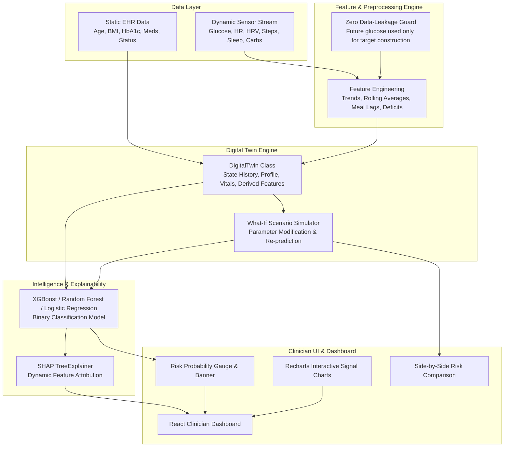

# GlucoTwin System Architecture

## Overview

**GlucoTwin** is a healthcare Digital Twin platform designed for **early prediction of significant glucose spikes (≥ 40 mg/dL increase)** within a **2-hour prediction horizon**.

Unlike standard static machine learning models, GlucoTwin maintains a continuous, stateful digital representation of a patient's physiology by merging static Electronic Health Record (EHR) data with high-frequency dynamic wearable sensor streams (15-minute sampling interval).

---

## High-Level Architecture Diagram

---

## Core Components

### 1. Data Ingestion & Synthetic Generator (`src/data/`)
* **`generate_synthetic.py`**: Produces realistic, non-random synthetic EHR profiles and continuous 15-minute time series (incorporating circadian rhythms, digestive dynamics, exercise clearance, and sleep deficits).
* **`process.py`**: Preprocesses raw streams, encodes categoricals, and handles missing data.

### 2. Feature Engineering & Data Leakage Guard (`src/features/`)
* Computes rolling statistics (1h, 2h, 4h averages & standard deviations), short-term trends (15m, 30m, 1h deltas), and meal proximity.
* **Data Leakage Safeguard**: Future glucose readings in the \([t+15\text{m}, t+2\text{h}]\) window are strictly restricted to target label definition (`target_spike`) and deleted from input features.

### 3. Digital Twin Engine (`src/twin/digital_twin.py`)
Stateful Python `DigitalTwin` object maintaining:
* Patient demographic & clinical profile.
* Rolling historical sensor state.
* `update_sensor_data()`: Ingests new 15-minute sensor ticks.
* `calculate_features()`: Updates derived features.
* `predict()`: Computes spike probability and risk level.
* `explain_prediction()`: Generates SHAP feature impact rankings.
* `simulate()`: Instantiates prospective digital twins to model what-if intervention outcomes.

### 4. Machine Learning & Explainability (`src/models/`, `src/explainability/`)
* Evaluates **Logistic Regression**, **Random Forest**, and **XGBoost**.
* Calculates Precision, Recall, F1-score, ROC-AUC, PR-AUC, and Confusion Matrix.
* Integrates **SHAP (SHapley Additive exPlanations)** for granular feature attribution.

---

## Health Safety & Disclaimer

> **Research Proof-of-Concept:** GlucoTwin is designed purely for academic, research, and proof-of-concept purposes. It is not intended for real clinical diagnosis, medication adjustment, or treatment decisions.
